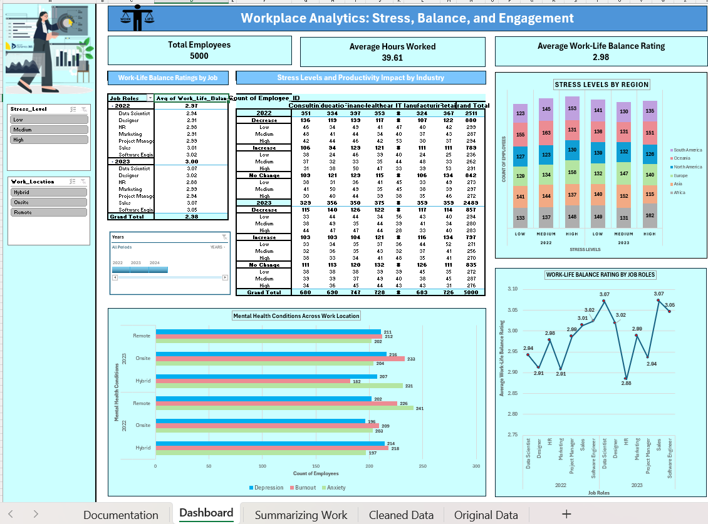
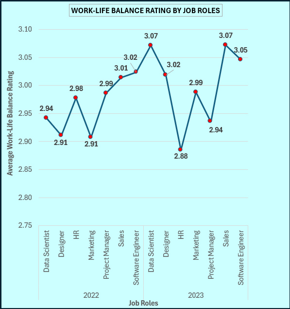
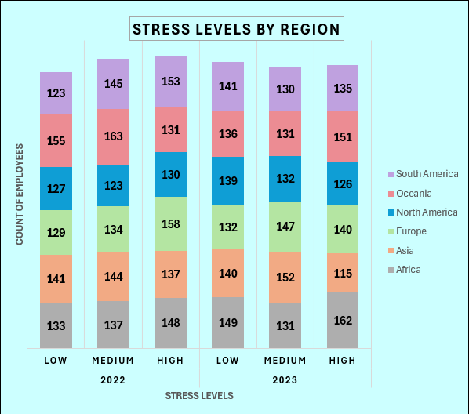
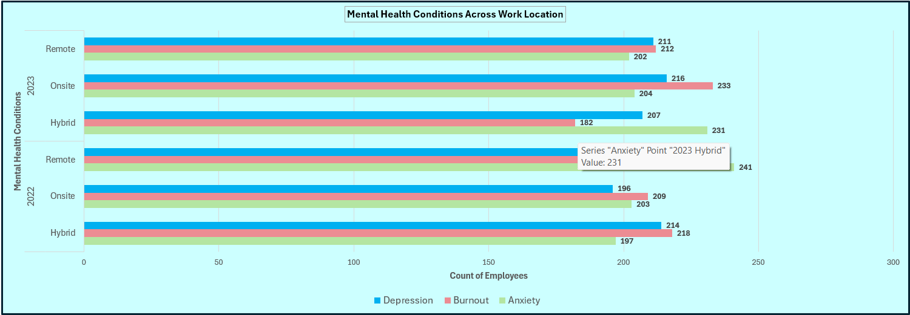
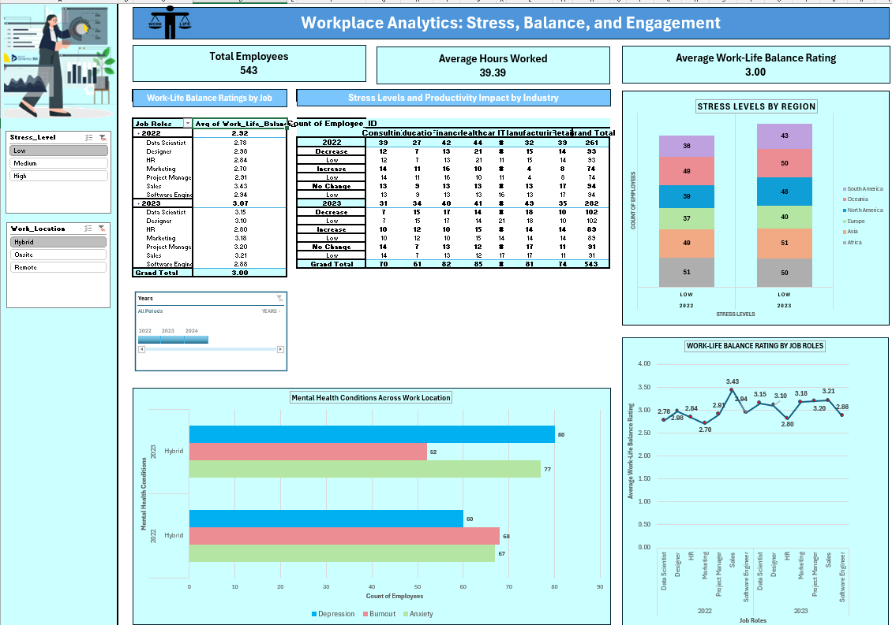
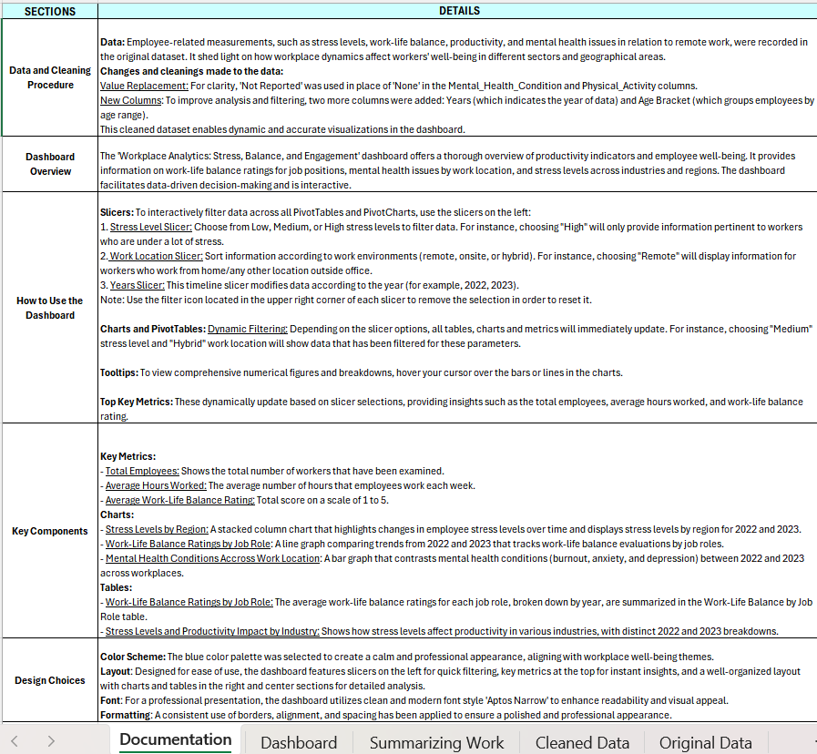

# Workplace-analytics-dashboard

This Excel dashboard analyzes key workplace factors such as stress levels, work-life balance, and employee engagement across industries and locations. It provides actionable insights to support HR teams and management in fostering a better work environment.

---

## 📊 Dashboard Overview

---

## 🚀 Features

- **Work-Life Balance by Job Position**  
  Visualizes average work-life balance ratings for different roles within the organization.  
  

- **Stress Levels Across Industries and Regions**  
  Highlights stress distribution across various industries and geographic locations.  
  

- **Mental Health Issues by Work Location**  
  Shows trends in mental health challenges based on employee location.  
  

- **Interactive Slicers**  
  Users can filter views based on various categories for deeper insights.  
  

- **Documentation Summary**  
  High-level overview of dashboard design and analysis approach.  
  

---

## 🛠️ Tools Used

- **Excel**: For dashboard creation, data visualization, and dynamic filtering  
- **Data Processing**: Cleaned and structured raw data for meaningful analysis

---

## 💡 Key Insights

- Employees in high-stress industries report lower work-life balance ratings.
- Regions with higher workloads tend to have more reported mental health issues.
- Improved employee engagement correlates with reduced stress levels and better productivity.

---

## 📁 File

- `Workplace Analytics Dashboard - Excel.xlsx` – Main Excel file containing the full dashboard and data analysis.
